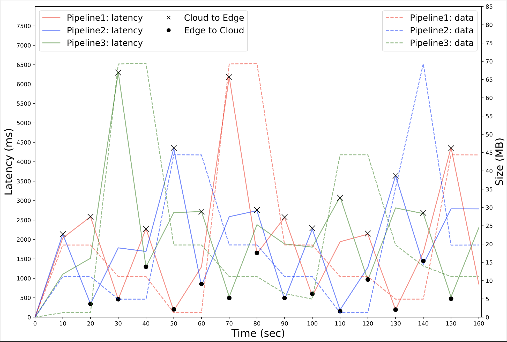
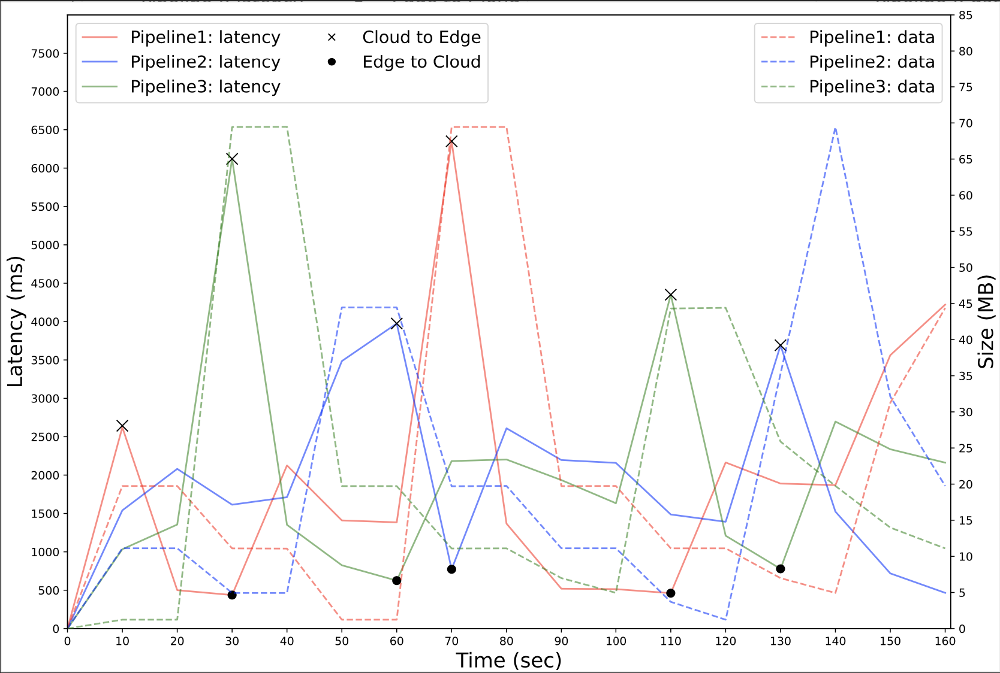
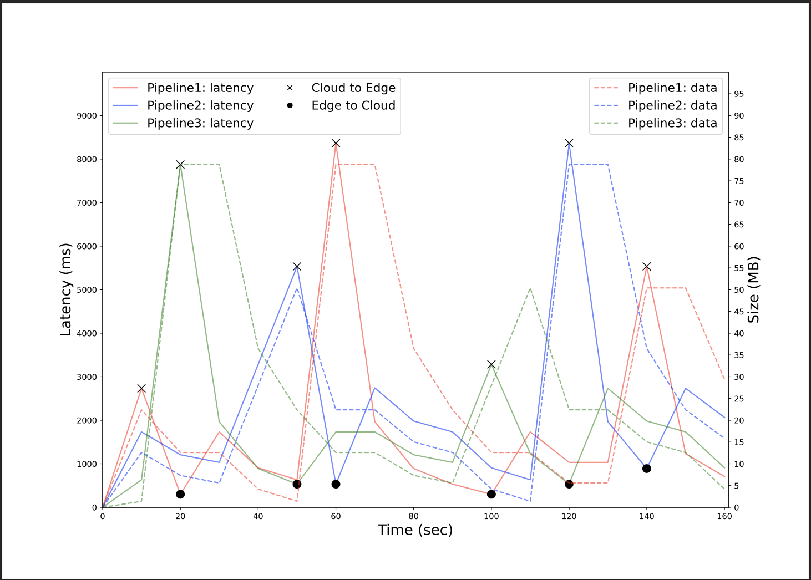

# ABS Platform for Edge-Cloud Workload Migration

The repository contains the ABS implementation of the SEAWALL platform enabling seamless orchestration of workloads in the edge-cloud continuum so that the latency of the alerting service is minimized requirement of the processing task is continuously met, while taking into account the constrained resources of the edge servers. Moreover, to test the accuracy of the ABS implementation, we reproduce the small-case industrial testbed presented in [1]. Differently from [1], here the deployment orchestrations, performing service migration, are automatically synthesized using the SmartDeployer tool [2], starting from declarative annotation describing service properties (e.g., resource required, functional dependencies, etc.).

## ABS Implementation

The industrial case-study of [1] is implemented in [architecture.abs](./architecture.abs). There are four services: 
- *Data Collector* gathers data from the production line and it is deployed as close as possible to such production line.
- *Data Processor* retrieves the latest measurements from the Data Collector and executes anomaly detection for discovering a possible misbehavior of the production line. Notice that, this service is moved between the cloud and edge layers depending on specific needs, e.g., reduce communication latency.
- *Data Alert* periodically triggers the Data Processor to get in output the response of a possible anomaly detection.
- A *Storage service* that acts as data lake of alerts and raw sensory data of the production line.
  
This file additionally containes the declarative specification of services and virtual machines hosting them, which are used in the process of automatic deployment orchestration synthesis.

The entity controlling the system orchestration process is implemented in [orchestrator.abs](./orchestrator.abs). In particular, it implements the migration policies adopted in [1], i.e., one based on latency and one based on the amount of data sent. 

The [orchestrations folder](./orchestrations) contains the deployment orchestrations synthesized via SmartDeployer [2].

Finally, [param.abs](./param.abs) and [main.abs](./main.abs) respectively contains the parameter inputed to the simulation and the main block to run such simulation.

## Experimental Results

In this section, we report the comparison between the [real-world experimental results](#rw-latency) and [those from the ABS simulation](#abs-latency). To model our ABS simulations, we use the same data from [1].

As can be seen in the figures below, reporting the results of experiments adopting a latency-based policy, the ABS implementation (the right-most figure) precisely reproduces the real-world behaviour (left-most figure).

<figure>
  <figcaption>Latency-based policy real-world implementation</figcaption>
  
</figure>

<figure>
  <figcaption>Latency-based policy ABS implementation</figcaption>
  
</figure>

As expected, nothing changes if we apply a differenct migration policy: as can be seen in the figures below, the [real-world behaviour](#rw-byte) is, again, precisely reproduced by the [ABS implementation](#abs-byte).

<figure>
  <figcaption>Byte-based policy real-world implementation</figcaption>
  
</figure>

<figure>
  <figcaption>Byte-based policy ABS implementation</figcaption>
  
</figure>

Finally, to further prove that the ABS implementation reproduce the real-world behaviour, let's consider the table below. As can be seen, both implementations suggest that both policies (latency-based and byte-based) perform equally, but the latter executes less swaps (i.e., migration of the Data Processor).

| | Latency-based policy (Real-world) | Byte-based policy (Real-world)| Latency-based policy (ABS) | Byte-based policy (ABS)|
|-----------------|-----------------|-----------------|-----------------|-----------------|
| Pipeline 1: swaps |11 | 4 | 8 | 5 |
| Pipeline 1: avg latency | 1.8s | 1.8s | 2s | 1.7s |
| Pipeline 2: swaps | 10 | 3 | 7 | 4 |
| Pipeline 2: avg latency | 1.8s | 1.8s | 2.1s | 2.1s |
| Pipeline 3: swaps | 8 | 4 | 8 | 4 |
| Pipeline 3: avg latency | 2s | 1.9s | 1.8s | 1.7s |

[1] [Low-Latency Anomaly Detection on the Edge-Cloud Continuum for Industry 4.0 Applications: The SEAWALL Case Study](https://ieeexplore.ieee.org/abstract/document/9945851)

[2] [SmartDeployer tool](https://github.com/jacopoMauro/abs_deployer)
